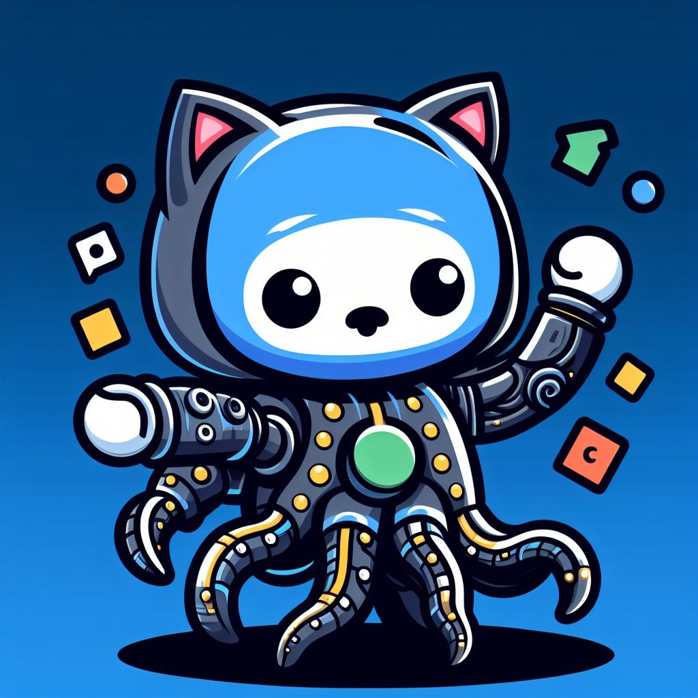

<div>
  
  <h1>Discord Workflow Status Action</h1>
  <h4>Notify Discord of workflow statuses 🤖</h4>
</div>

## Inputs

| Input Name        | Description                                                             | Required | Default                                                                                                                           |
| ----------------- | ----------------------------------------------------------------------- | -------- | --------------------------------------------------------------------------------------------------------------------------------- |
| `strict`          | If the action should fail in the absence of `discord-webhook` [[1]](#1) |          | `true`                                                                                                                            |
| `github-token`    | GitHub Token [[2]](#2)                                                  | ✅       |                                                                                                                                   |
| `discord-webhook` | Discord Webhook URL                                                     |          | `""` (an empty string)                                                                                                            |
| `username`        | Overrides the current username of the webhook                           |          | GitHub Actions                                                                                                                    |
| `avatar-url`      | Overrides the current avatar of the webhook                             |          | [Avatar]("https://github.com/jmg-duarte/discord-workflow-status/blob/f303b155a2868ed6b32d42b8b27895ccf05fd438/static/avatar.jpg") |

> <a name="1">[1]</a> `strict` was added to ease forking repositories depending on this action
> as the webhook should be a secret (which, unless you add it, will not be available in forks).
> If `strict` is false, the action will _not_ fail in the absence of `discord-webhook` and instead return a "success" status.
> Once GitHub adds full support for [`core.setNeutral`](https://github.com/actions/toolkit/tree/main/packages/core#exit-codes),
> instead of resulting in "success" (which fails to properly describe the action result),
> this action should result in "neutral" (or whatever name they decide for it).
>
> <a name="2">[2]</a> The GitHub token is required because this action reads the current workflow's jobs.
> See [`octokit.actions.listJobsForWorkflowRun`](https://octokit.github.io/rest.js/v19#actions-list-jobs-for-workflow-run) for more information.

## Example

```yaml
name: Build and Test
on: [pull_request]

jobs:
  build:
    name: Build the Code
    steps:
      - run: make all
  notify:
    name: Notify Discord
    runs-on: ubuntu-latest
    if: ${{ always() }} # You always want to be notified: success, failure, or cancelled
    needs:
      - build
    steps:
      - name: Notify
        uses: jmg-duarte/workflow-notify-discord@v1
        with:
          github-token: ${{ secrets.GITHUB_TOKEN }}
          discord-webhook: ${{ secrets.DISCORD_WEBHOOK }}
```
